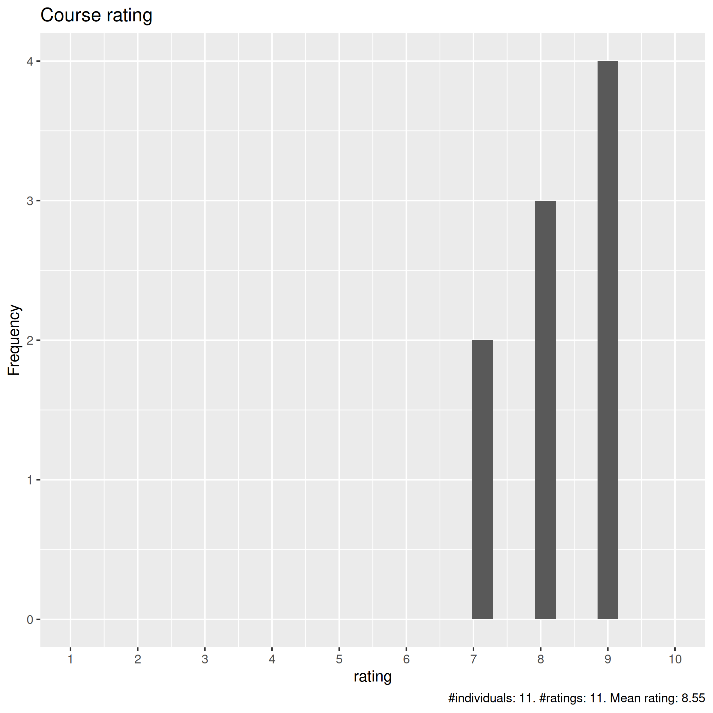
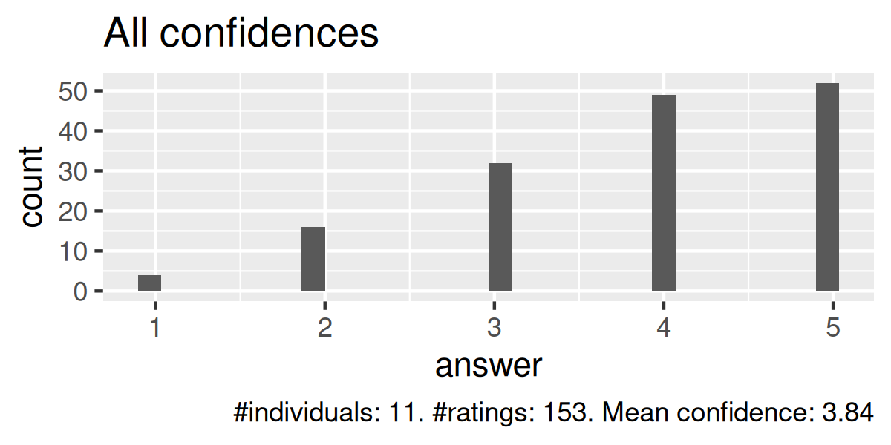
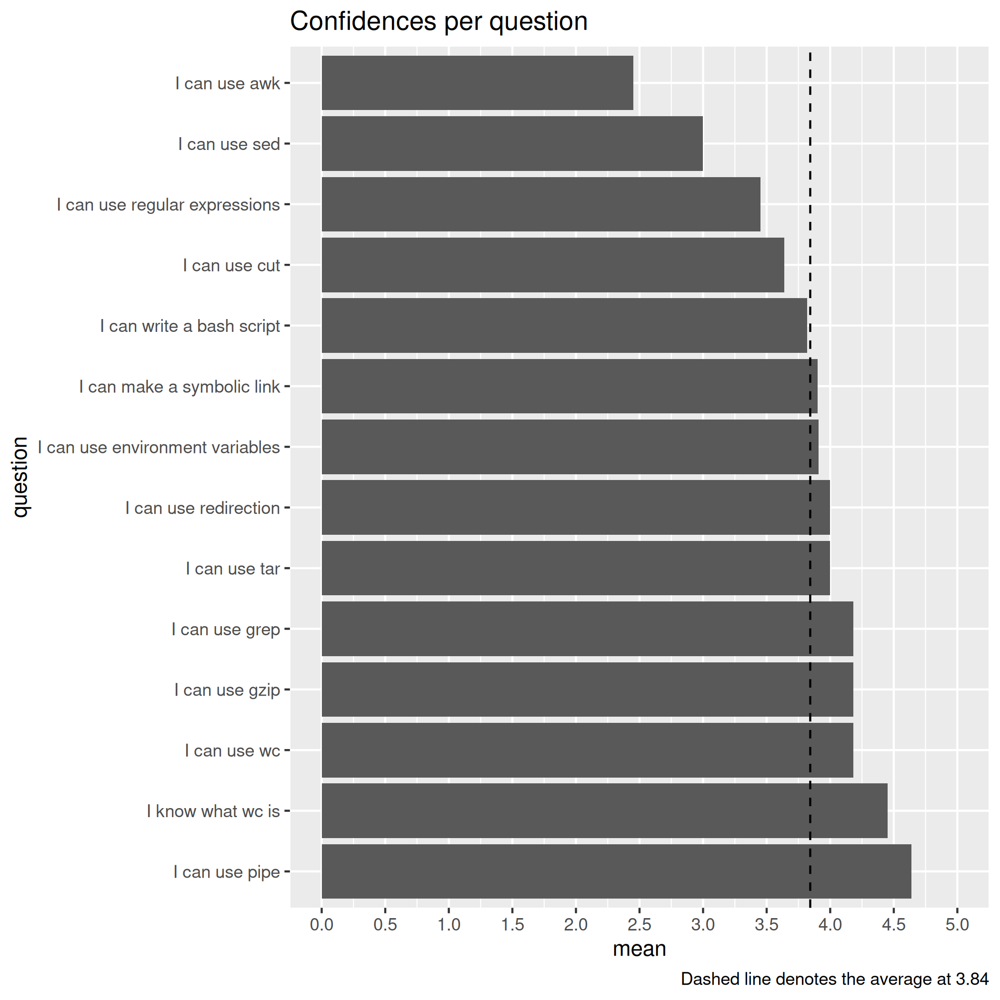
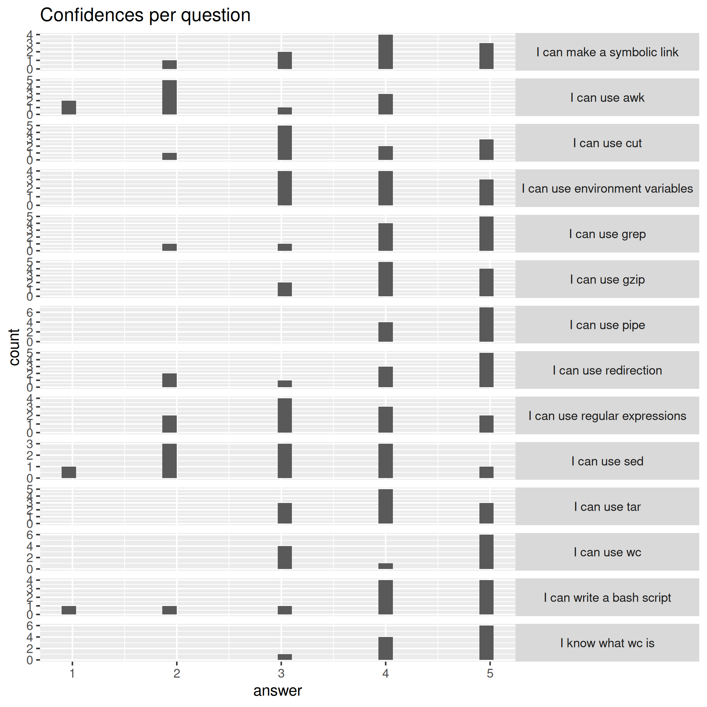
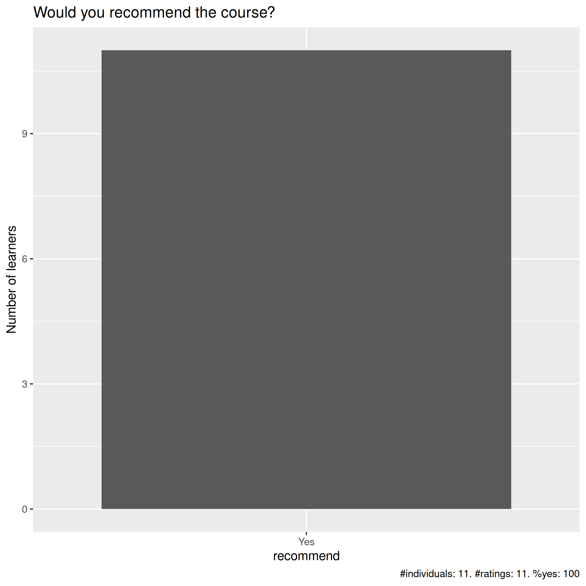

# Evaluation 2025-06-02 and 2025-06-03

- Date: 2025-06-02 and 2025-06-02
- Number of registrations: 40
- Number of learners on Day 1:
    - Showing up: 15 (38% showing up)
    - Being present most of the time: 11 (28% actively participating)

## Analysis

- [Evaluation results (csv)](results.csv)
- [Evaluation results (xlsx)](results.xlsx)
- [Analysis script](analyse.R)
- [Average confidence per question (.csv)](average_confidences.csv)
- [Success score](success_score.txt): 77%

### [Pace](pace.txt)

- good, perhaps slightly quick
- It is balanced.
- I was good
- I think is good but I did not code along as I saw that then I catch less information
- today intensive and less time to do exercise
- Good! just tight for the exercises
- The pace was good, quite high but for this type of intermediate course I think that is not a problem. I can go back to the things I found the most interesting or difficult later.
- A little quick, some extra time would help particularly for Birgittes section
- The pace was excellent
- Ok on Monday, a bit rushed towards the end on Tuesday
- Maybe it was a bit quick? I mean, it was easy to follow and understand, but then there was very little time to actually practice the exercises properly. I think it's normal given that the course was short!

### [Future topics](future_topics.txt)

- python? why we have so many languagues? what do they add ?
- Different file systems, efficient editing of text files using Vim e.g. multiline find and replace, substitution etc.
- I don´t think anything else can be provided
- same but advance and longer
- automating proccesses and more into bashrc
- Perhaps showing real examples of these tools are used in research/scripts we may use
- Advanced Bash and Linux of course! :)
- R and machine learning
- Fortran course, Object-oriented-programming in Python course

### [Other comments](comments.txt)

- organization, hands-oon exercises, material for consultation after course, engagement ;)
- I really liked the idea of asking questions to participants and involve them in dsicussions.
- More takeaway exercises
- Thanks
- The structure, materials, examples and tutors were great! Easy to follow either with the code-along or with the engaging questions. Training organization was also really good. It could be a bit longer to cover more aspects but as an intro to the concepts is adequate. All the teaching aids were well prepared. Hands-on and demos were fun and right amount! I specifically liked the first parts of each day, the second part seemed a bit more rushed, but still good.
- This was a great course! Since I have been working with bash for a few years I had come across most of the tools previously but now I have a much better understanding of what they do and how to use them. The length of the course was good and the content was perfect for my level. I liked the variation of code-along sessions mixed with more independent work in break-out rooms. It was great that we were invited to answer questions while it was respected that not everyone might want to. I appreciated that you kept to the schedule quite strictly, and that there was a clear structure both for the whole course and for each session.
- Enjoyed the break out rooms and having time to work through the examples in Richèls material. Think that some of the general concepts could be better explained from the start but did appreciate being shown how commands work in real time through the teachers command line. I think an extra hour of time for each day could improve the course to have more time to go through the examples in Birgittes material and discuss the answers together as only having a few minutes felt sometimes rushed. I overall found this course very useful and learnt a lot of new commands but maybe would appreciate some examples of how I can use these in my own bioinformatics work.
- I think the selected material was good and represents a lot of the useful tools in Linux and the basics of Bash. When it said Intermediate Bash, I expected though that we would do a bit more advanced things, but given the time frame it was maybe not realistic. There was a good amount of hand-on vs demonstration I think. The supplementary material was nice, the quality of them is good and I will happily refer back to them. The main problem I have with the course is awk and sed were a bit rushed (too much content in too little time) compared to bash scripting being a bit superficial. Maybe it's better to raise prerequisites a bit, so that people should know the basics of Bash before starting. Then more time could be spent on awk and sed. I feel like I did not really learn how to use those any better than I knew before or see any really effective uses of them. An alternative could be an extra 3 hour session for those topics if you do not want to drop the introduction to Bash. I think both teachers were excellent and encouraged active participation, whether through breakout rooms or through encouraging exercises. The last session about QoL was also really useful and had some tips I did not know before. Thanks to everyone who organised it!
- The material was uneven - some parts are really good and can be reread when you are going through it yourself and reminding yourself how it was done, and other part was too sparse (lacked any theory). This was mainly a problem for the awk session which would have been easier to understand if there was a short text with some of the common commands and such. Reading a book is good, and might be how you learn well in a longer course, but it did not work for me for learning in a short course like this that should more be a help for us to do our research better.
- I think everything was great considering how short the training event was. I would maybe separate the two days next time: instead of Mon-Tue, you ould try Mon-Wed or Tue-Thu so that there is one empty day in between, and you could assign some exercises to do in that empty day. I think this would give students more time to practice what they learn in the course

## Feedback in chat

> Hi, I’m sorry but I need to leave!
> Thank you for the course, it was very useful.
> I look forward to the course evaluation. Bye!
