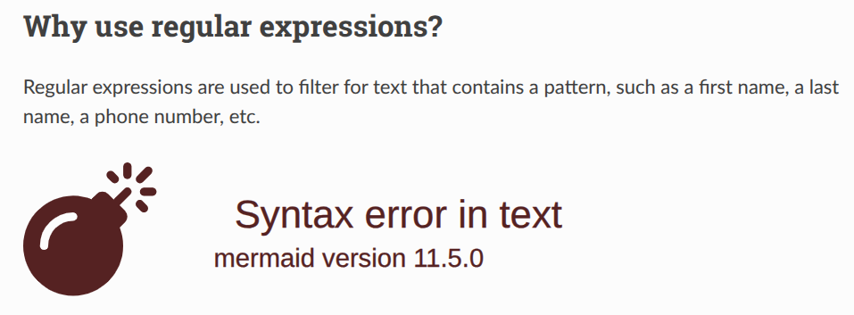

# Lesson plan 2025-06-02 by Richel

- Date: 2025-06-02
- Author: Richel

## Morning 1: smarter command-line

I am in the middle of the schedule:

Time        | Topic                 |Teacher
------------|-----------------------|-------
9:00-10:00  |Linux pipe, `wc`, `cut`|BB
10:00-10:15 |Break                  |.
10:15-11:00 |`grep`                 |RB
11:00-11:15 |Break                  |.
11:15-12:00 |`awk`                  |RB

I should assume the learners can use a pipe,

## `grep`

My learning outcomes are:

- Learners can use `.`, `*`, `+`, `?`, `[]`, `[^]`, `{}`, `()` in regular expressions
- Learners can use `grep` for pattern matching
- [Learners have practiced using a book on bash/Linux](https://github.com/UPPMAX/naiss_intermediate_bash_linux/issues/7)

Add LOs are:

- Learners have experienced that `grep` is a filter
- Learners have sent text to `grep` using a pipe, e.g. `man grep | grep "[^A-Z]`
- Learners know there are multiple flavours of regular expressions:
  use `grep` and `grep -E`

As sources of text, I consider to use:

- 'Frankenstein; Or, The Modern Prometheus',
  from
  [a plain text file at Project Gutenberg](https://www.gutenberg.org/cache/epub/84/pg84.txt)
- `man grep` or `yelp man:grep` or `man grep | grep "^[A-Z]"`
- [https://www.regexone.com/](https://www.regexone.com/)
- `[Shotts, 2024]`
  [download](https://sourceforge.net/projects/linuxcommand/files/AWTLCL/21.10/AWTLCL-21.10.pdf/download)
  and can be found in this repository at `books/the_linux_command_line.pdf`
- man grep | grep "^[[:upper:]]"

Using the `grep` manual and
[https://www.regexone.com/](https://www.regexone.com/)
felt like the best options.

Fixing the layout is harder, e.g. getting `mermaid` to work, making the
admonitions prettier (fails).

I will give up on `mermaid`:

I think this session is ready now, but I can imagine
writing the next session may influence it,
so let's write the next session first,
before creating a video.

## `awk`

It used to be `sed` and `awk` in an earlier schedule. Commit
`7282e58552cdbeb7bf70b0f3133ac2bee7702a33` moved `sed` to Day 2.
I will accept: we (me and BB) are probably both working in the weekend,
so let's accept this change.

My LOs are:

- I can use `awk`
- [Learners have practiced using a book on bash/Linux](https://github.com/UPPMAX/naiss_intermediate_bash_linux/issues/7)

I've inherited the first one from BC and BB and is simple enough,
unlike the ones for `grep`, where I added some details.

I will add some LOs:

- I can use `awk` in pipes
- I can use regular expressions in `awk`
- I can use `awk` to read a specific column
- I can use `awk` to transform text

Non-LOs:

- I can use `awk` to analyse a file: the day is called 'Smart command-line'

Books to use:

- [Bash Beginners Guide](https://tldp.org/LDP/Bash-Beginners-Guide/Bash-Beginners-Guide.pdf)
  [chapter 6](https://tldp.org/LDP/Bash-Beginners-Guide/html/chap_06.html),
  from [section 6.2](https://tldp.org/LDP/Bash-Beginners-Guide/html/sect_06_02.html)
  to section 6.2.3 seems to work in my context
- [Advanced Bash Scripting Guide](https://tldp.org/LDP/abs/abs-guide.pdf),
  page [C2. Awk](https://tldp.org/LDP/abs/html/awk.html)
  is a micro primer, with some usefulness
- [A practical guide to learning awk](https://opensource.com/downloads/awk-ebook):
  uses files, not pipes
- [Gawk: Effective AWK Programming](https://www.gnu.org/software/gawk/manual/):
  too complex for the LOs
- [The Linux Command Line](https://linuxcommand.org/tlcl.php): no chapter on AWK
- [Introduction to Linux](https://tldp.org/LDP/intro-linux/intro-linux.pdf):
  no chapter on AWK
- [Linux Fundamentals](https://linux-training.be/linuxfun.pdf): no chapter on AWK
- [Ultimate Linux Newbie Guide](https://linuxnewbieguide.org/ulngebook2017/):
  no chapter on AWK
- [Advanced Linux programming](http://www.cse.hcmut.edu.vn/~hungnq/courses/nap/alp.pdf):
  no chapter on AWK
- [Linux From Scratch](https://www.linuxfromscratch.org/): no chapter on AWK
- [Beyond Linux From Scratch](https://www.linuxfromscratch.org/blfs/read.html):
  no chapter on AWK

I will use the Bash Beginners Guide.

Mapping sessions to LOs:

- 6.2.1: I can use `awk` in pipes
- 6.2.1: I can use `awk` to read a specific column
- 6.2.2: I can use `awk` to transform text
- 6.2.3: I can use regular expressions in `awk`

Seems this works!

I will map these to exercises, and adding a 'Can awk do ...?' section.

## References

- `[Shotts, 2024]` Shotts, William.
  The Linux command line: a complete introduction. No Starch Press, 2024.
  (in `books/the_linux_command_line.pdf`)
