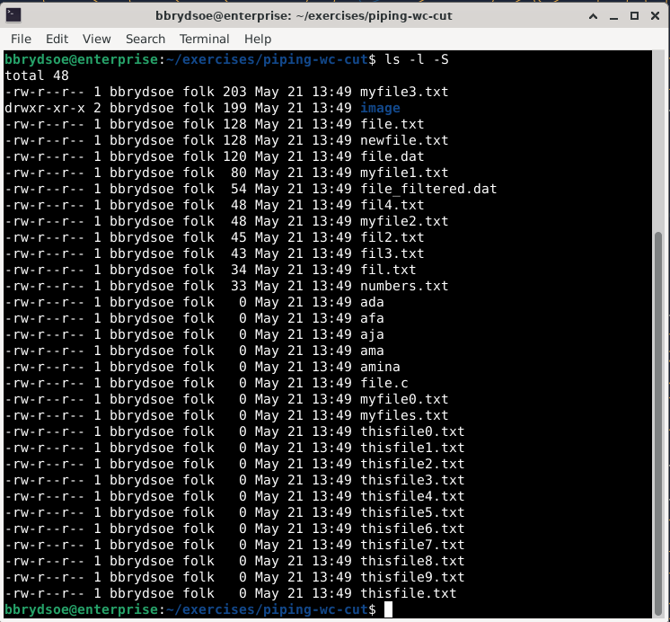
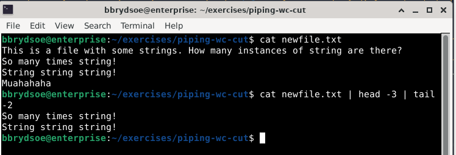

<!-- markdownlint-disable MD013 --><!-- Let's break the 80 characters per line -->
<!-- markdownlint-disable MD009 --><!-- Let's stop checking for trailing spaces -->
# Pipe

!!! note "Learning objectives"

    - learn about the operator pipe
        - when to use it
        - how to use it
    - try some examples with pipe

!!! note

    The operator ``pipe`` (or pipeline) is used to chain commands; i.e. pipes are used when you want to take the output of one command and use it as input for another command. It is symbolized by a ``|`` between the commands.

    This is often called “to pass output to another command”.

In many cases it is possible to do the same with an intermediate file (or more), but it is often better to just combine the commands with one or more pipes.

Pipes are very useful, and will be used in several of the following sections!

## Syntax

Using a pipe between two or more commands look like this:

```bash
<command 1> | <command 2> | <command 3> | ...  | <command N>
```

## Some commands

We will use a number of Linux commands in this section for illustrating how pipes work. They were all covered in the Basic Linux course and are listed in prerequisites, but here is a brief reminder of their function:

??? note "Click to reveal"

    - **less**: forward and backward navigation and also has search options. Usage ``less FILE``. Exit with: ``q``
    - **more**: forward navigation and limited backward navigation in a file named FILE. Usage: ``more FILE``. Exit with: ``q``
    - **cat**: a tool for file-related operations (view, concatenate, create, copy, merge, and manipulate file contents). Usage: ``cat [option] FILE`` where option is various optional options
    - **find**: The find command is used for file and directory search. You can search by name, size, modification time, or content. Usage: ``find [path] [options] [expression]`` where common options are
        - **-type f**: only search for files
        - **-type d**: only search for directories
        - **-name NAME**: only search for files with a specific name NAME or pattern
        - **-size [+/-]n**: Searches for files based on size. +n finds larger files, -n finds smaller files. ‘n‘ measures size in characters.
        - **-mtime n**: Finds files based on modification time. n represents the number of days ago.
        - **-exec command {} \;**: Executes a command on each file found.
    - **sort**: The sort command is used in Linux to print the output of a file in given order.
        - **-n**: compare according to string numerical value
        - **-f**: ignore case
        - **-b**: ignore leading blanks
        - **-k keydef**: by size where keydef is start and stop position
        - **-r**: reverse
    - **head**: prints the first lines of a file. Usage: ``head -n FILE``
    - **tail**: prints the lines at the end of a file. Usage: ``tail -n FILE``
    - **echo**: displays lines of text or strings that are passed as arguments. Usage: ``echo [option] [string]``
    - **tee**: Copy standard input to each file and also to standard output. Usage: ``tee [option] ... [file1] [file2] ... ``

## Examples of piping

!!! hint

    Type along!

To run the examples, go to the "exercises" -> "piping-wc-cut" directory where there are files that are suitable to run these examples on.

!!! note "Using one pipe: List all files and directories and give as input to `more`"

    This is useful if there are many files in the directory and you would like to see them/scroll through them.

    ```bash
    $ ls -l | more
    ```

    Output:

    


!!! note "Using one pipe: Sort a list of files by size"

    ```bash
    $ ls -l | sort -k 5
    ```

    

    Of course, sorting files by size could also be done with ``ls -l -S`` but then you would have less control of how it was sorted (largest file first, sorted in lexicographical order).

    

    If you want to sort file size in reverse order you can do it like this:

    ```bash
    $ ls -l -S | sort -k 5 n
    ```

!!! note "Using one pipe: echo and sort"

    I write a couple lines which I echo, then I sort the output

    ```bash
    $ echo "This is a line of text, which I am writing
    > I am continuing to write another line
    > and another line" | sort
    ```

    It will look like this:

    ```bash
    bbrydsoe@enterprise:~/exercises/piping-wc-cut$ echo "This is a line of text, which I am writing
    > I am continuing to write another line
    > and another line" | sort
    and another line
    I am continuing to write another line
    This is a line of text, which I am writing
    ```

!!! note "Using two pipes: head and tail to print lines in a specific range in a file"

    ```bash
    $ cat newfile.txt | head -2 | tail -3
    ```

    Output (also showing the output of cat itself so you can see the file content):

    

!!! note "Using two pipes: head and tail to print lines of the output from the ls command"

    ```bash
    ls | head -3 | tail -1
    ```

    Output:

    ```bash
    bbrydsoe@enterprise:~/exercises/piping-wc-cut$ ls
    ada       fil4.txt           myfile0.txt  thisfile0.txt  thisfile7.txt
    afa       file.c             myfile1.txt  thisfile1.txt  thisfile8.txt
    aja       file.dat           myfile2.txt  thisfile2.txt  thisfile9.txt
    ama       file_filtered.dat  myfile3.txt  thisfile3.txt  thisfile.txt
    amina     file.txt           myfiles.txt  thisfile4.txt
    fil2.txt  fil.txt            newfile.txt  thisfile5.txt
    fil3.txt  image              numbers.txt  thisfile6.txt
    bbrydsoe@enterprise:~/exercises/piping-wc-cut$ ls | head -3 | tail -1
    aja
    bbrydsoe@enterprise:~/exercises/piping-wc-cut$
    ```

!!! note "Using two pipes: sort the output of tail on ls"

    ```bash
    $ ls -l | tail -14 | sort -n
    ```

!!! note "Using more pipes: find, sort, tail"

    Here I find all the files with a name with suffix .txt, sort them, and then pick the last 4 in the sorted list:

    ```bash
    find . -type f -name "*.txt" | sort | tail -4
    ```

    Output:

    ```bash
    bbrydsoe@enterprise:~/exercises/piping-wc-cut$ find . -type f -name "*.txt" | sort | tail -4
    ./thisfile7.txt
    ./thisfile8.txt
    ./thisfile9.txt
    ./thisfile.txt
    ```

!!! note "Using more pipes: find, sort, head, tee"

    Here I find all the files with a name with suffix .txt, sort them, and then pick the first 4 in the sorted list, which I then use tee to send to a file (named list.txt) and also to output:

    ```bash
    find . -type f -name "*.txt" | sort | head -4 | tee list.txt
    ```

## Exercise

1. Sort (string numerical, in reverse) files ending in .txt
2. Print the 4 first lines of the list of files ending in .txt
3. Print the last 5 lines of the list of files ending in .txt and sort them, then print the first line of the output
4. Use ``echo`` to output 5 lines you write then use tail to print the last line.

## Summary

As you have seen, ``pipe`` is a very useful operator, one which we will meet again in the later sections, combined with many commands and in scripts.

!!! note "Keypoints"

    - we learned about pipe
    - we tried using one or more pipes to combine commands

