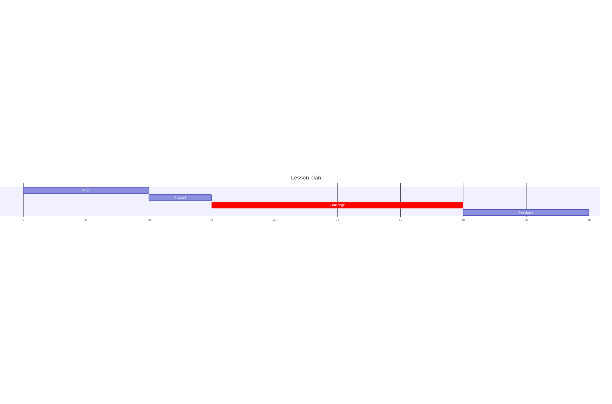
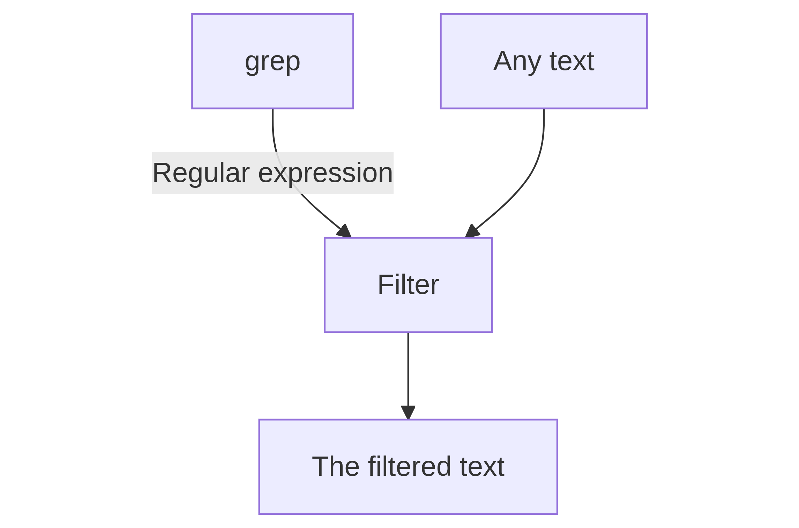

---
tags:
  - grep
  - regular expressions
---

# Regular expressions and `grep`

!!! info "Learning outcomes"

    - Learners can use `grep` for pattern matching
    - Learners have practiced using the `grep` manual
    - Learners have experienced that `grep` is a filter
    - Learners have sent text to `grep` using a pipe
    - Learners know there are multiple flavours of regular expressions
    - Learners can use `.`, `*`, `+`, `?`, `[]`, `[^]`, `{}`, `()` in regular expressions
    - (optional) Learners have seen the flexibility of `grep`

???- note "For teachers"

    Lesson plan (45 mins):

    

    Prior:

    - What is a regular expression?
    - What is a parser?
    - What is GNU?
    - What is `grep`?
    - In the context of command-line tools, what is a filter?


## Why use regular expressions?

Regular expressions are used to filter for text that contains a pattern,
such as a first name, a last name, a phone number, etc.



## Why use `grep`?

The tool `grep` comes installed with Linux and is an abbreviation
of 'GNU regular expression parser'.
GNU, an abbreviation of 'GNU's Not Unix!', is a
collection of free software (among others: `grep`)
that comes with Linux.
A parser is a program that can work with a text pattern,
such as regular expression.

## Exercises

## Exercise 1: use the `grep` manual

In this exercise, we'll use the `grep` manual.

---

### Exercise 1.1: view the `grep` manual

View the `grep` manual.

Tip: `man` is the command to view a manual.

??? tip "Answer"

    In the terminal, type:

    ```bash
    man grep
    ```

    Use the arrow keys to navigate and `q` to quit

---

### Exercise 1.2: what does `grep` do?

According to the `grep` manual, **in a one-liner**, what does `grep` do?

Tip: it is at the top.

??? tip "Answer"

    `grep` is a tool to 'print lines that match patterns'
    It is in the fourth line:

    ```console
    NAME
           grep, egrep, fgrep, rgrep - print lines that match patterns
    ```

---

### Exercise 1.3: what are the other `grep`s?

In the fourth line of the `grep` manual, the
`grep`-like tools `egrep`, `fgrep` and `rgrep` are mentioned.
What are these?

Tips:
    - it is in the first two screens.
    - The first part of the answer can be found
      in the `DESCRIPTION` section,
    - The second part of the answer can be found
      in the `OPTIONS | Pattern syntax` section

??? tip "Answer"

    The first part of the answer is in the description:

    <!-- markdownlint-disable MD013 --><!-- Answer will be shown as-is, hence will break 80 characters per line -->

    ```console
    DESCRIPTION
           grep  searches  for  PATTERNS  in  each  FILE. [...]

           [...]

           Debian also includes the variant programs egrep, fgrep and rgrep.  These programs
           are the same as grep -E, grep -F, and grep -r, respectively. 
          [...]
    ```

    <!-- markdownlint-enable MD013 -->

    Searching for `-E`, `-F` and `-r` takes us to the
    'OPTIONS | Pattern Syntax' subsection:

    ```console
    Pattern Syntax
       -E, --extended-regexp
              Interpret PATTERNS as extended regular expressions [...].

       [...]

       -G, --basic-regexp
              Interpret  PATTERNS  as basic regular expressions [...].

       -P, --perl-regexp
              Interpret PATTERNS as Perl-compatible regular expressions [...].
    ```

    We can conclude from this that the different `grep`s have different types
    of regular expressions, such as a regular, extended and Perl-compatible
    regular expressions.

---

## Exercise 2: use `grep` with a pipe

In this exercise, we use `grep` with a pipe.

### Exercise 2.1: read a command that has a `grep` with a pipe

How would you explain the command below in English?
Use 'some regular expression' if you see a regular expression.

```bash
man grep | grep "^[A-Z]"
```

??? tip "Answer"

    The manual of `grep`, send it to `grep` and let it filter for
    some regular expression.

---

### Exercise 2.2: run a command that has a `grep` with a pipe

Run the command above. What does it show on screen?
What did that regular expression do?

??? tip "Answer"

    This is what is shown on screen:

    <!-- markdownlint-disable MD013 --><!-- Answer will be shown as-is, hence will break 80 characters per line -->

    ```bash
    $ man grep | grep "^[A-Z]"
    GREP(1)                               User Commands                              GREP(1)
    NAME
    SYNOPSIS
    DESCRIPTION
    OPTIONS
    REGULAR EXPRESSIONS
    EXIT STATUS
    ENVIRONMENT
    NOTES
    COPYRIGHT
    BUGS
    EXAMPLE
    SEE ALSO
    GNU grep 3.11                          2019-12-29                                GREP(1)
    ```

    It shows all lines that start with an uppercase character.

    <!-- markdownlint-enable MD013 -->

---

## Exercise 3: practice regular expressions

Go to [https://www.regexone.com/](https://www.regexone.com/)
and do lessons 1 to (and including) 11.

???- info "Overview of these lessons"

    Here is an overview of the regular expression patterns in each lesson:

    Lesson|Pattern
    ------|-------
    1     |None
    1.5   |`\d`
    2     |`.`
    3     |`[]`
    4     |`[^]`
    5     |`[A-Z]`
    6     |`{}`
    7     |`*` (Kleene star) and `+` (Kleene plus)
    8     |`?`
    9     |`\s`
    10    |`^`
    11    |`()`

---

## (optional) Exercise 4: can `grep` do ...?

Here we'll experience the flexibility of `grep`.
Pick those topics you are interested in.

Use the `grep` manual to answer these questions.

---

### (optional) Exercise 4.1: Can `grep` do a case-insensitive match?

Can `grep` do a case-insensitive match?

??? tip "Answer"

    Yes. 

    The `--ignore-case` allows you
    to let `grep` do a case-insensitive search.

    For example, in the command below,
    the word 'options' is searched in the manual
    in a case-insensitive manner.

    <!-- markdownlint-disable MD013 --><!-- Verbatim text will be shown as-is, hence will break 80 characters per line -->

    ```bash
    $ man grep | grep --ignore-case "options"
    OPTIONS
                  use -i, to cancel its effects because the two options override each other.
                  options that prefix their output to the actual content: -H,-n, and -b.  In
                  options are given, the  last  matching  one  wins.   If  no  --include  or
                  --exclude  options  match, a file is included unless the first such option
       Other Options
                  other GNU programs.  POSIX requires that options that  follow  file  names
                  must  be  treated  as file names; by default, such options are permuted to
                  the front of the operand list and are treated  as  options.   Also,  POSIX
                  requires  that  unrecognized  options be diagnosed as “illegal”, but since
           treats expansions of “*g*.h” starting with “-” as file names not options, and the
    ```

    <!-- markdownlint-enable MD013 -->

---

### (optional) Exercise 4.2: Can `grep` show the lines that do not match?

Can `grep` show the lines that **do not** match?

??? tip "Answer"

    Yes. 

    The `--invert-match` allows you
    to let `grep` show lines that do not match.

    For example, in the command below,
    the `grep` manual is search for lines that *do not* have a space.

    ```bash
    man grep | grep --invert-match " "
    ```

---

### (optional) Exercise 4.3: Can `grep` detect lines in multiple files?

Can `grep` detect lines in multiple files?

??? tip "Answer"

    Yes.

    The `--recursive` allows you to let `grep`
    search in multiple files.

    For example, in the commands below,
    the folder `/etc` is searched for files that contain the text 'ubuntu':

    ```bash
    cd /etc
    grep --recursive "ubuntu"
    ```

---

### (optional) Exercise 4.4: Can `grep` detect which files contain a match?

Can `grep` detect which files contain a match?

??? tip "Answer"

    Yes.

    The `--files-with-matches` allows you to let `grep`
    output which files contained a match.

    For example, in the commands below,
    the folder `/etc` is searched for files that contain the text 'ubuntu',
    showing the files in which a match is found:

    ```bash
    cd /etc
    grep --recursive --files-with-matches "ubuntu"
    ```

---

<!-- markdownlint-disable MD013 --><!-- Indeed a long title, hence will break 80 characters per line -->

### (optional) Exercise 4.5: Can `grep` detect which files-with-a-certain-extension contain a match?

<!-- markdownlint-enable MD013 -->

Can `grep` detect which files-with-a-certain-extension contain a match?

??? tip "Answer"

    Yes.

    The `--include` allows you to let `grep`
    only include files in its

    For example, in the commands below,
    the folder `/etc` is searched in configuration (`.conf`)
    files that contain the text 'ubuntu'.

    ```bash
    cd /etc
    grep --recursive "ubuntu" --include "*.conf"
    ```

---

??? info "For teachers"

    - How many regular expression dialects exist?

    ??? tip "Answer"

        At least 3: 

        - `grep` (basic)
        - `egrep` (extended)
        - `pgrep` (Perl-like)


    ---

    - We have sent the `grep` manual to `grep` using a pipe.
      Can we use any text?

    ??? tip "Answer"

        Yes: the `grep` manual is just text like any other.

    ---

    - Can we send the output of `grep` to `grep`?

    ??? tip "Answer"

        Yes: the `grep` output is just text like any other.

    ---

    - What is a Kleene star and what does it do?

    ??? tip "Answer"

        The Kleene star is the regular expression pattern `*`.
        In English it would be read as: 'the thing before it
        repeated at least zero times'.


    ---

    - What is the difference between `[^A-Z]` and `^[A-Z]`?

    ??? tip "Answer"

        The first regular expression means: 'All characters, except all uppercase
        letters'.

        The second regular expression means: 'At the start of a line, any uppercase
        letter'.

    ---

    - What is regular expression for 'any line of text' (including empty ones)?

    ??? tip "Answer"

        The regular expression for 'any line of text' is `.*`,
        as `.` means 'Any character' and `*` means 'repeated at least zero times'.

    ---

    - Why does `man grep | grep .*` not work, where `man grep | grep ".*"` does?

    ??? tip "Answer"

        The double-quotes assure that the regular expression patter `.*` is
        read as such.

        The 'naked' `.*` is a `bash` expression of 'all hidden files',
        as hidden files start with a `.` (e.g. `ls .*`).
        This meaning can change depending on context (e.g. `cat .*`).

    ---

    - Knowing that `grep --ignore-case` ignores case, and `grep --invert-match`
      inverts the match (i.e. showing non-matching lines), how to combine these
      in the same command?

    ??? tip "Answer"

        Write these one after the other:

        ```bash
        grep --ignore-case --invert-match
        ```

        For example, the command below shows all lines in the `grep` manual
        that do not have the lower-case, nor upper-case letters 'a' to
        (and including) 'f'.

        ```bash
        man grep | grep --ignore-case --invert-match "[a-f]"
        ```

!!! info "Conclusions"

    - `grep` is used for pattern matching
    - `grep` has a useful manual
    - `grep` is a filter
    - `grep` works well with pipes
    - There are multiple regular expression dialects
    - The pattern `.`, `[]` and `[^]` are used
      to (not) match a (set of) characters
    - The pattern `*`, `+`, `?` and `{}` are used to indicate an amount
    - The pattern `()` is used to capture a set of a match
    - (optional) `grep` can do a lot of different things

---

!!! info "Next session"

    - `grep` cannot do replacements, use `sed` instead.
