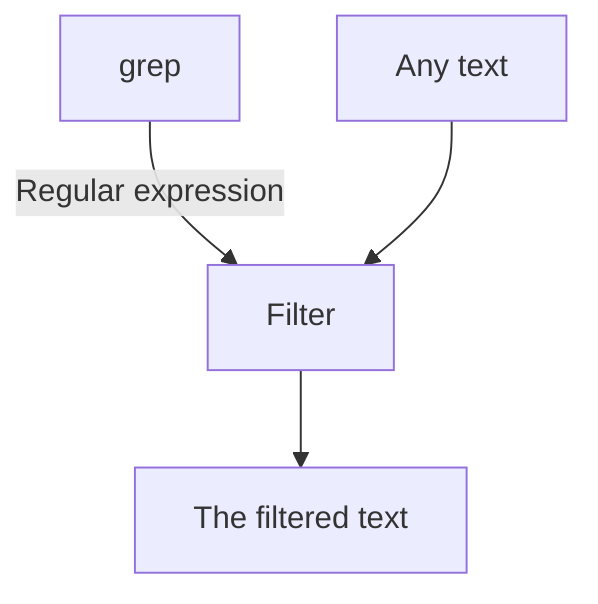

---
tags:
  - grep
  - regular expressions
---

# Regular expressions and `grep`

!!! info "Learning outcomes"

    - Learners can use `grep` for pattern matching
    - Learners have practiced using the `grep` manual
    - Learners have experienced that `grep` is a filter
    - Learners have sent text to `grep` using a pipe
    - Learners know there are multiple flavours of regular expressions
    - Learners can use `.`, `*`, `+`, `?`, `[]`, `[^]`, `{}`, `()` in regular expressions
    - (optional) Learners have seen the flexibility of `grep`

??? info "For teachers"

    Lesson plan (45 mins):

    ```mermaid
    gantt
      title Lesson plan
      dateFormat X
      axisFormat %s
      Prior : prior, 0, 10s
      Present: present, after prior, 5s
      Challenge: crit, challenge, after present, 20s
      Feedback: feedback, after challenge, 10s
    ```

    Prior:

    - What is a regular expression?
    - What is a parser?
    - What is GNU?
    - What is `grep`?
    - In the context of command-line tools, what is a filter?


## Why use regular expressions?

Regular expressions are used to filter for text that contains a pattern,
such as a first name, a last name, a phone number, etc.



## Why use `grep`?

The tool `grep` comes installed with Linux and is an abbreviation
of 'GNU regular expression parser'.
GNU, an abbreviation of 'GNU's Not Unix!', is a
collection of free software (among others: `grep`)
that comes with Linux.
A parser is a program that can work with a text pattern,
such as regular expression.

## Exercises

## Exercise 1: see the `grep` manual

Use the `grep` manual for this exercise.

???- question "How do I view the `grep` manual?"

    In the terminal, type:

    ```bash
    man grep
    ```

    Use the arrow keys to navigate and `q` to quit


- According to the `grep` manual, in a one-line answer, what does `grep` do?
  Tip: it is at the top

???- question "Answer"

  `grep` is a tool to 'print lines that match patterns'
  It is in the fourth line:

  ```console
  NAME
         grep, egrep, fgrep, rgrep - print lines that match patterns
  ```


- In the fourth line of the `grep` manual, the
  `grep`-like tools `egrep`, `fgrep` and `rgrep` are mentioned.
  What are these?
  Tips:
    - it is in the first two screens.
    - The first part of the answer can be found
      in the `DESCRIPTION` section,
    - The second part of the answer can be found
      in the `OPTIONS | Pattern syntax` section

## Exercise 2: use `grep` with a pipe

- How would you explain the command below in English?
  Use 'some regular expression' if you see a regular expression.

```bash
man grep | grep "^[A-Z]"
```

???- question "Answer"

  The manual of `grep`, send it to `grep` and let it filter for
  some regular expression.


- Run the command above. What does it show on screen?
  What did that regular expression do?

???- question "Answer"

    This is what is shown on screen:

    ```bash
    $ man grep | grep "^[A-Z]"
    GREP(1)                               User Commands                              GREP(1)
    NAME
    SYNOPSIS
    DESCRIPTION
    OPTIONS
    REGULAR EXPRESSIONS
    EXIT STATUS
    ENVIRONMENT
    NOTES
    COPYRIGHT
    BUGS
    EXAMPLE
    SEE ALSO
    GNU grep 3.11                          2019-12-29                                GREP(1)
    ```

    It shows all lines that start with an uppercase character.


## Exercise 3: practice regular expressions

???- question "For teachers"

    Here is an overview of the regular expression patterns in each lesson:

    Lesson|Pattern
    ------|-------
    1     |None
    1.5   |`\d`
    2     |`.`
    3     |`[]`
    4     |`[^]`
    5     |`[A-Z]`
    6     |`{}`
    7     |`*` (Kleene star) and `+` (Kleene plus)
    8     |`?`
    9     |`\s`
    10    |`^`
    11    |`()`


- Go to [https://www.regexone.com/](https://www.regexone.com/)
  and do lessons 1 to (and including) 11.

## (optional) Exercise 4: can `grep` do ...?

Here we'll experience the flexibility of `grep`.
Pick those topics you are interested in.

Use the `grep` manual to answer these questions.

- Can `grep` do a case-insensitive match?

???- question "Answer"

    Yes. 

    The `--ignore-case` allows you
    to let `grep` do a case-insensitive search.

    For example, in the command below,
    the word 'options' is searched in the manual
    in a case-insensitive manner.

    ```bash
    $ man grep | grep --ignore-case "options"
    OPTIONS
                  use -i, to cancel its effects because the two options override each other.
                  options that prefix their output to the actual content: -H,-n, and -b.  In
                  options are given, the  last  matching  one  wins.   If  no  --include  or
                  --exclude  options  match, a file is included unless the first such option
       Other Options
                  other GNU programs.  POSIX requires that options that  follow  file  names
                  must  be  treated  as file names; by default, such options are permuted to
                  the front of the operand list and are treated  as  options.   Also,  POSIX
                  requires  that  unrecognized  options be diagnosed as “illegal”, but since
           treats expansions of “*g*.h” starting with “-” as file names not options, and the
    ```


- Can `grep` show the lines that **do not** match?

???- question "Answer"

    Yes. 

    The `--invert-match` allows you
    to let `grep` show lines that do not match.

    For example, in the command below,
    the `grep` manual is search for lines that *do not* have a space.

    ```bash
    man grep | grep --invert-match " "
    ```


- Can `grep` detect lines in multiple files?

    Yes.

    The `--recursive` allows you to let `grep`
    search in multiple files.

    For example, in the commands below,
    the folder `/etc` is searched for files that contain the text 'ubuntu':

    ```bash
    cd /etc
    grep --recursive "ubuntu"
    ```


- Can `grep` detect which files contain a match?

    Yes.

    The `--files-with-matches` allows you to let `grep`
    output which files contained a match.

    For example, in the commands below,
    the folder `/etc` is searched for files that contain the text 'ubuntu',
    showing the files in which a match is found:

    ```bash
    cd /etc
    grep --recursive --files-with-matches "ubuntu"
    ```


- Can `grep` detect which files-with-a-certain-extension contain a match?

    Yes.

    The `--include` allows you to let `grep`
    only include files in its

    For example, in the commands below,
    the folder `/etc` is searched in configuration (`.conf`)
    files that contain the text 'ubuntu'.

    ```bash
    cd /etc
    grep --recursive "ubuntu" --include "*.conf"
    ```


## Feedback

- How many regular expression dialects exist?

???- question "Answer"

    At least 3: 

    - `grep` (basic)
    - `egrep` (extended)
    - `pgrep` (Perl-like)


- We have sent the `grep` manual to `grep` using a pipe.
  Can we use any text?

???- question "Answer"

    Yes: the `grep` manual is just text like any other.


- Can we send the output of `grep` to `grep`?

???- question "Answer"

    Yes: the `grep` output is just text like any other.


- What is a Kleene star and what does it do?

???- question "Answer"

    The Kleene star is the regular expression pattern `*`.
    In English it would be read as: 'the thing before it
    repeated at least zero times'.


- What is the difference between `[^A-Z]` and `^[A-Z]`?

???- question "Answer"

    The first regular expression means: 'All characters, except all uppercase
    letters'.

    The second regular expression means: 'At the start of a line, any uppercase
    letter'.


- What is regular expression for 'any line of text' (including empty ones)?

???- question "Answer"

    The regular expression for 'any line of text' is `.*`,
    as `.` means 'Any character' and `*` means 'repeated at least zero times'.


- Why does `man grep | grep .*` not work, where `man grep | grep ".*"` does?

???- question "Answer"

    The double-quotes assure that the regular expression patter `.*` is
    read as such.

    The 'naked' `.*` is a `bash` expression of 'all hidden files',
    as hidden files start with a `.` (e.g. `ls .*`).
    This meaning can change depending on context (e.g. `cat .*`).


- Knowing that `grep --ignore-case` ignores case, and `grep --invert-match`
  inverts the match (i.e. showing non-matching lines), how to combine these
  in the same command?

???- question "Answer"

    Write these one after the other:

    ```bash
    grep --ignore-case --invert-match
    ```

    For example, the command below shows all lines in the `grep` manual
    that do not have the lower-case, nor upper-case letters 'a' to
    (and including) 'f'.

    ```bash
    man grep | grep --ignore-case --invert-match "[a-f]"
    ```

