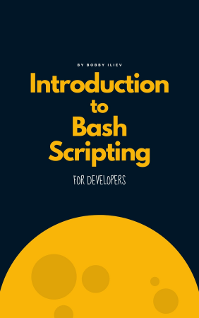

---
tags:
  - session
  - lesson
  - scripting
  - bash
  - script
---

# Scripting

!!! info "Learning outcomes"

    - Learners can write Bash scripts
    - Learners have practiced using a book on Bash scripting
    - Learners can write Bash scripts that require user input
    - Learners can use variables in Bash scripts
    - Learners can use `if` statements in Bash scripts
    - Learners can use `for` statements  in Bash scripts

???- note "For teachers"

    Lesson plan:

    Time |Duration|Description
    -----|--------|---------
    0-10 |10      |Prior
    10-15|5       |Present
    15-50|35      |Challenge
    50-60|10      |Feedback

    Prior:

    - What is script?
    - What is bash?
    - What is meant with 'user input'?
    - What is a variable?
    - What is a condition?
    - What is a conditional?
    - What is a for-loop?

???- note "For teachers"

    Lesson plan:

    Time |Duration|Description
    -----|--------|---------
    0-10 |10      |Prior
    10-15|5       |Present
    15-35|20      |Challenge
    35-45|10      |Feedback

    Prior:

    - What is a script?
    - What is bash?
    - What does the program `touch` do?
    - What is a shebang?
    - What is a variable?
    - What is 'user input'?

## Why use scripts?

Scripts allow you to run you (bash) commands in an easy and
reproducible manner.

!!! note "The different spellings"

    Spelling|Description
    --------|------------------------
    Bash    |The programming language
    `bash`  |The program

## Exercises

In these exercises, we'll be using the
book 'Introduction to Bash scripting for developers',
as this book fits this course well, is free and open source
and allows you to continue studying after this course



### Exercise 1: Bash structure

- Read the text at
  [chapter 2: 'Bash structure'](https://github.com/bobbyiliev/introduction-to-bash-scripting/blob/main/ebook/en/content/002-bash-structure.md)
- Create a file called `greeter.sh` with a shebang
  following that chapter

??? tip "Answer"

    In a terminal, type:

    ```bash
    touch greeter.sh
    ```

    Add the following line to the file:

    ```bash
    #!/bin/bash
    ```

    Remember that if this does not work on your computer, use the more
    flexible shebang:


    ```bash
    #!/usr/bin/env bash
    ```

---


### Exercise 2: Hello world

- Read the text at
  [chapter 3: 'Hello world'](https://github.com/bobbyiliev/introduction-to-bash-scripting/blob/main/ebook/en/content/003-bash-hello-world.md)
- Modify your Bash script called `greeter.sh` in such a way that
  you can run ('execute') it. When it runs, it should show 'Hello World!'
  on the screen. Run the script to verify

??? tip "Answer"

    Edit `greeter.sh` to:

    ```bash
    #!/bin/bash
    echo "Hello World!"
    ```

    For the terminal, make `greeter.sh` executable with:

    ```bash
    chmod +x greeter.sh
    ```

    You can now run it with:

    ```bash
    ./greeter.sh
    ```

---


### Exercise 3: Bash variables

- Read the text at
  [chapter 4: 'Bash Variables'](https://github.com/bobbyiliev/introduction-to-bash-scripting/blob/main/ebook/en/content/004-bash-variables.md)
- Modify your Bash script called `greeter.sh` in such a way that
  it uses two variables:
    - `greeting`, which should have value `Hello`
    - `name`, which should have value `World`
  When it runs, it should (still) show 'Hello World!'
  on the screen. Run the script to verify

??? tip "Answer"

    Edit `greeter.sh` to:

    ```bash
    #!/bin/bash
    greeting="Hello"
    name="World"

    echo "$greeting $name!"
    ```

    You can now (still) run it with:

    ```bash
    ./greeter.sh
    ```

---

### Exercise 4: counting files

Bash can store the output of other tools in variables.

Write a script that counts and shows the number of files in our current folder:

- Create an executable script called `count_files.sh`.
- In the script, create a variable called `n_files` and initialize it like this:

  ```bash
  n_files=$(ls | wc --lines)
  ```

- Running the script should show: 'You have [n_files] files', where
  `[n_files]` is the number of files


- Run the script to verify

??? tip "Answer"

    Edit `greeter.sh` to:

    ```bash
    #!/bin/bash
    n_files=$(ls | wc --lines)

    echo "You have ${n_files} files"
    ```

    You can now run it with:

    ```bash
    ./count_files.sh
    ```

---

### Exercise 5: user input

- Read the text at
  [chapter 5: 'User input'](https://github.com/bobbyiliev/introduction-to-bash-scripting/blob/main/ebook/en/content/005-bash-user-input.md)
- Modify your Bash script called `greeter.sh` in such a way that
  the script asks for a name using the text 'Who to greet?'.
  If the name `World` is typed it, it should (again) show 'Hello World!'
  on the screen. Run the script to verify

??? tip "Answer"

    Edit `greeter.sh` to:

    ```bash
    #!/bin/bash

    echo "Who to greet?"
    read name

    greeting="Hello"

    echo "$greeting $name!"
    ```

    You can (still) run it with:

    ```bash
    ./greeter.sh
    ```

---

### Exercise 6: conditional expressions

- Read the text at
  [chapter 9: 'Conditional expressions'](https://github.com/bobbyiliev/introduction-to-bash-scripting/blob/main/ebook/en/content/009-bash-conditional-expressions.md)
- We will modify your Bash script called `greeter.sh` in such a way that
  when the name 'Bond' it chosen, the program shows `It is Bond. James Bond!`,
  else it shows the regular greeting. Which conditional will you need?

??? tip "Answer"

    ```bash
    [[ ${arg1} -eq ${arg2} ]]
    ```

---

### Exercise 7: conditionals

- Read the chapters 'If statement' and 'If Else statement' of
  [chapter 10: 'Conditionals'](https://github.com/bobbyiliev/introduction-to-bash-scripting/blob/main/ebook/en/content/010-bash-conditionals.md),
  do **not read** 'Switch case statements'
- Modify your Bash script called `greeter.sh` in such a way that
  when the name 'Bond' it chosen, the program shows `It is Bond. James Bond!`,
  else it shows the regular greeting. Run the script to verify

??? tip "Answer"

    Edit `greeter.sh` to the example below.
    There are multiple solutions.

    ```bash
    #!/bin/bash

    echo "Who to greet?"
    read name

    greeting="Hello"

    if [[ name -eq "Bond" ]]
    then
        echo "It is Bond. James Bond!"
    else
        echo "$greeting $name!"
    fi
    ```

    You can (still) run it with:

    ```bash
    ./greeter.sh
    ```

---


### Exercise 8: For loops

- Read only the 'For loops' section of
  [chapter 11: 'Bash loops'](https://github.com/bobbyiliev/introduction-to-bash-scripting/blob/main/ebook/en/content/011-bash-loops.md)
- Create a new Bash script called `greet_names.sh`.
  The script should:
    - Ask who to greet, with the text `Who shall I greet?`.
      The expected input are names separated by spaces, e.g. `Anna Berndt Cindy`
    - Greet all of these people in the form `Hello [name]!`,
      using a for loop to go through the names
    - Run the script to verify

??? tip "Answer"

    Edit `greet_names` to the example below.
    There are multiple solutions.

    ```bash
    #!/bin/bash

    echo "Who shall I greet?"
    read names

    for name in ${names}
    do
        echo "Hello ${name}!"
    done
    ```

    You can run it with:

    ```bash
    ./greet_names.sh
    ```

---

### Exercise 9: For loops with Bash commands

Instead of iterating over names,
we can iterate over something useful instead,
such as the output of a Bash command.

- Create a new Bash script called `show_files.sh`.
  The script should:
    - Store the output of `ls` in a variable called `filenames`
    - Per filename, show `I found a file called [filename]!`,
    where `[filename]` is the name of the file
    - Run the script to verify

??? tip "Answer"

    Edit `greeter.sh` to the example below.
    There are multiple solutions.

    ```bash
    #!/bin/bash

    filenames=$(ls)

    for filename in ${filenames}
    do
        echo "I found a file called {filename}!"
    done
    ```

    You can run it with:

    ```bash
    ./show_files.sh
    ```

---

??? note "For teachers"

    What is the difference between AWK and Bash?

    ??? tip "Answer"

        They are different programming languages.

    What can Bash not do?

    ??? tip "Answer"

        Bash, like any Turning complete language,
        can solve any computational problem,
        but cannot do this:

        - run computations at any speed (i.e. a problem
          may take billions of year to complete)
        - use any amount of memory (i.e. a problem
          may require billions of gigabytes to solve)

    When not to use Bash?

    ??? tip "Answer"

        Bash shines at problems of low and intermediate complexity,
        as it can connect all Bash commands.

        For harder problems, use a modern programming language
        instead.

---

## Conclusions

!!! info "Conclusions"

    - Bash can do most things one expects from a programming language
    - A Bash script starts with a shebang: `#!/bin/bash`
    - A Bash script can be made executable: `chmod +x greeter.sh`
    - A Bash script can be run by writing `./` in front of the filename:
      `./greeter.sh`
    - A Bash script can use variables: `greeting="Hello"`
    - A Bash script can run Bash commands and store the result in a variable:
      `n_files=$(ls | wc --lines)`
    - A Bash script can ask the user for input: `read name`
    - A Bash script can do conditionals:

      ```bash
      if [[ name -eq "Bond" ]]`
      then
          echo "It is Bond. James Bond!"
      else
          echo "$greeting $name!"
      fi
      ```

    - A Bash script can use for-loops:

      ```bash
      for name in ${names}
      do
          echo "Hello ${name}!"
      done
      ```

---

## Next session

!!! info "Next session"

    - Bash can do much more

